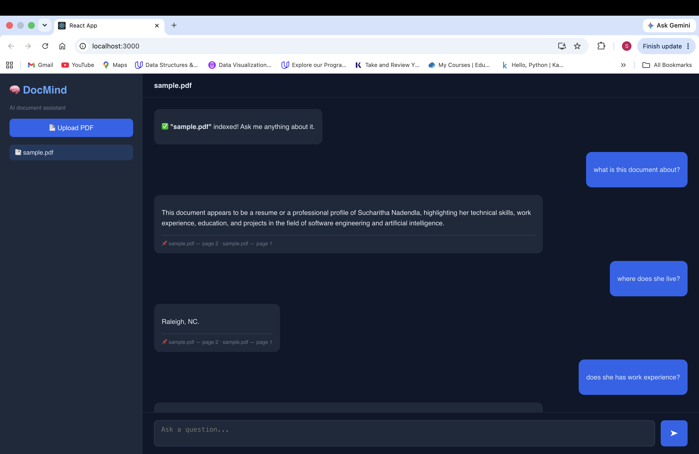

# 🧠 DocMind — AI Document Assistant

A full-stack RAG (Retrieval-Augmented Generation) application that lets you upload any PDF and ask natural language questions about it using AI.

## 🎥 Demo
> Upload a PDF → Ask questions → Get answers with source citations



## 🏗️ Architecture

```
PDF Upload → Text Chunking (sliding window) → Embeddings (sentence-transformers)
                                                        ↓
                                              Pinecone (vector store)
                                                        ↓
User Question → Embed query → Similarity Search → Top-k Chunks
                                                        ↓
                               Groq LLM (Llama 3) → Answer + Citations
```

## 🛠️ Tech Stack

| Layer | Technology |
|---|---|
| Backend | FastAPI (Python) |
| Embeddings | sentence-transformers `all-MiniLM-L6-v2` |
| Vector Database | Pinecone (serverless) |
| LLM | Groq API — Llama 3.3 70B |
| Frontend | React |

## ⚙️ Setup

### 1. Get Free API Keys
- **Pinecone**: [pinecone.io](https://pinecone.io) → Sign up → Create API key
- **Groq**: [console.groq.com](https://console.groq.com) → Sign up → Create API key

### 2. Backend
```bash
cd backend
python -m venv venv
source venv/bin/activate
pip install -r requirements.txt

cp .env.example .env
# Add your API keys to .env
uvicorn main:app --reload
```
Backend runs at: http://localhost:8000  
API docs at: http://localhost:8000/docs

### 3. Frontend
```bash
cd frontend
npm install
npm start
```
Frontend runs at: http://localhost:3000

## 🔍 How It Works

1. **Upload PDF** — text is extracted and split into 500-word overlapping chunks
2. **Embed** — each chunk is converted to a 384-dimensional vector using `all-MiniLM-L6-v2`
3. **Store** — vectors and metadata are stored in Pinecone with a `doc_id` filter for multi-document support
4. **Query** — user question is embedded and top-4 most similar chunks are retrieved
5. **Generate** — Groq (Llama 3) generates a grounded answer using only the retrieved context

## 📡 API Endpoints

| Method | Endpoint | Description |
|---|---|---|
| GET | `/` | Health check |
| POST | `/upload` | Upload and index a PDF |
| POST | `/query` | Ask a question about a document |
| GET | `/docs-list` | List all uploaded documents |

## 💡 Key Design Decisions

- **Sliding window chunking** with overlap prevents context loss at chunk boundaries
- **Metadata filtering** in Pinecone enables multi-document support in one index
- **Grounded prompting** instructs the LLM to answer only from retrieved context, reducing hallucinations
- **Lazy model loading**  sentence-transformers model is loaded once and reused across requests

## 🚧 Future Improvements
- Add authentication for multi-user support
- Support more file types (DOCX, TXT)
- Deploy on AWS (EC2 + S3 for PDF storage)
- Add conversation history for follow-up questions
